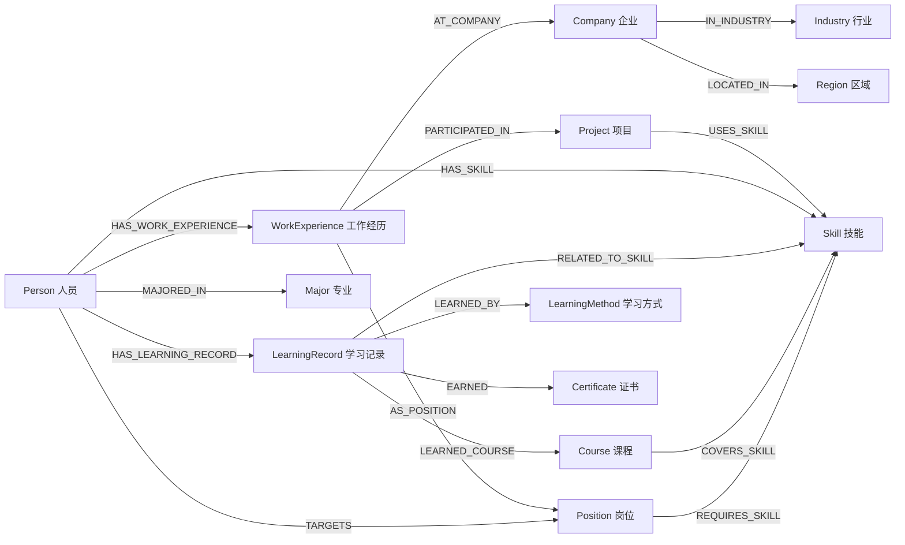

# 图谱相关需求与 Neo4j POC 交接说明

## 1. 文档目的

本文用于将当前已梳理的图谱需求、设计假设、Neo4j POC 文件和后续工作交接给其他智能体或研发人员。

当前阶段客户尚未反馈实体、关系、数据格式和图谱用途等关键细节，因此 POC 使用虚构招聘场景数据，目标是先验证图谱结构和 Neo4j 可视化效果，不代表最终生产模型。

## 2. 客户需求摘要

### 2.1 简历与工作经历图谱

客户原始需求：

> 系统解析简历，提取岗位、时间、行业、企业、项目、能力等要素，构建工作经历总图谱，并按项目、行业、区域、岗位等维度形成子图谱。

当前需要客户确认：

1. 简历输入是结构化字段、Word/PDF、图片扫描件，还是混合格式。
2. 是否需要重新解析历史简历，以及历史数据规模。
3. 一期具体抽取字段：岗位、任职时间、行业、企业、项目、技能、区域、学历、证书等。
4. 图谱的业务用途：人才画像、人才检索、人才推荐、项目匹配、关系展示或统计分析。
5. 实体、属性和关系的正式定义。
6. “子图谱”是筛选后的局部视图，还是分别建设的独立图谱。
7. 企业、岗位、行业、技能、区域的标准字典、唯一键、别名和归并规则。
8. 标准实体是否跨个人共享，个人工作经历和项目经历是否独立保存。
9. 解析结果是否需要人工确认和修正。
10. 字段抽取准确率、支持格式、数据量等验收标准。

### 2.2 个人学习综合图谱

客户原始需求：

> 系统解析个人学习综合图谱，自动提取专业、课程、岗位、时间、学习方式等要素。

当前需要客户确认：

1. 学习数据来源：课程平台、培训平台、证书系统、考试系统、人工录入或其他来源。
2. 一期字段范围：专业、课程、学习方式、学习时间、成绩、证书、技能、目标岗位等。
3. 图谱用途：学习档案、课程推荐、岗位能力差距分析或人才画像补充。
4. 是否已有岗位—技能—课程能力模型；没有时由哪一方制定。
5. 课程完成、成绩、证书如何影响技能标签或能力等级。
6. 学习图谱是否与工作经历图谱关联，以及关联依据。

## 3. 已确认的项目边界

| 项目 | 当前结论 |
| --- | --- |
| 客服知识来源 | 客户提供业务文档。 |
| 客服功能入口 | 客户提供功能名称、URL 地址、功能描述等结构化数据。 |
| 链接访问规则 | 本期不考虑。 |
| “猜你想问” | 基于当前对话和个人历史提问。 |
| 转人工与反馈 | 本期不考虑。 |
| 内容运营 | 本期不考虑。 |
| 数据、安全与接口 | 当前整体不考虑。 |
| 图谱演示方式 | 先以关系图可视化为重点。 |
| 图谱组织 | 工作经历与学习信息统一到以人员为中心的人才图谱。 |
| 样例数据 | 使用虚构招聘人才样例，不使用客户或真实个人信息。 |
| 脚本目标 | Neo4j 5 原生 Cypher，不依赖 APOC。 |

## 4. POC 设计决策

### 4.1 设计原则

- `Person` 是统一人才图谱的入口。
- 企业、岗位、行业、区域、技能、课程、专业等作为可共享的标准实体。
- 工作经历、项目经历、学习记录和个人技能掌握情况作为个人事实节点或关系属性。
- 时间使用经历、项目和学习记录节点上的 `startDate`、`endDate` 属性表达，不单独建立年月节点。
- 所有实体使用稳定业务编码，不使用姓名作为唯一键。
- POC 脚本不执行清库，不依赖 APOC，种子数据关系使用 `MERGE`，可重复执行。

### 4.2 核心节点

| 标签 | 唯一键 | 用途 |
| --- | --- | --- |
| `Person` | `personId` | 候选人或人才。 |
| `WorkExperience` | `workExperienceId` | 一段工作经历。 |
| `Company` | `companyId` | 企业。 |
| `Position` | `positionId` | 标准岗位。 |
| `Industry` | `industryId` | 行业。 |
| `Region` | `regionId` | 区域。 |
| `Project` | `projectId` | 项目经历。 |
| `Skill` | `skillId` | 技能或能力项。 |
| `Major` | `majorId` | 所学专业。 |
| `LearningRecord` | `learningRecordId` | 一次学习记录。 |
| `Course` | `courseId` | 课程。 |
| `LearningMethod` | `methodId` | 学习方式。 |
| `Certificate` | `certificateId` | 证书或认证。 |

### 4.3 核心关系



关键关系属性：

- `HAS_SKILL`：`proficiencyLevel`、`acquiredDate`、`source`。
- `REQUIRES_SKILL`：`minimumLevel`。
- `COVERS_SKILL`：`coverageLevel`。
- `PARTICIPATED_IN`：`role`。

## 5. 已交付 POC 文件

文件目录：`neo4j人才图谱POC/`

| 文件 | 内容 |
| --- | --- |
| `01_schema.cypher` | Neo4j 5 唯一约束和索引，共 13 类实体约束。 |
| `02_seed_demo_data.cypher` | 4 名虚构候选人、4 家企业、5 个岗位、6 个项目、11 项技能、课程、学习记录、证书及关系数据。使用 `MERGE`，可重复执行。 |
| `03_demo_queries.cypher` | 6 个 Neo4j Browser 查询：人员全景、项目技能岗位关系、岗位候选人能力证据、课程技能岗位关系、技能生态、节点统计。 |
| `图谱模型说明.md` | 节点、关系、脚本执行顺序、演示方式和真实数据接入建议。 |
| `tests/verify_graph_poc.ps1` | 静态验收脚本，检查交付文件、约束、关系、无 APOC 和演示查询覆盖。 |

## 6. 脚本执行方式

### 6.1 推荐执行顺序

在目标 Neo4j 数据库中按以下顺序执行：

1. 执行 `01_schema.cypher`。
2. 执行 `02_seed_demo_data.cypher`。
3. 在 Neo4j Browser 中逐个执行 `03_demo_queries.cypher` 中的查询块。

建议先在专用 POC 数据库或空库执行。种子脚本虽然不会清库，但使用固定示例编码时会更新同编码节点的示例属性。

### 6.2 当前 Neo4j 环境

客户提供的服务端信息显示：

- Neo4j Server：`5.26.13`
- Edition：`Community`
- Neo4j Browser：`2025.8.0`
- 数据库：当前连接为 `neo4j`

Neo4j Community 通常不支持在同一实例内通过 `CREATE DATABASE` 创建多个数据库。因此当前 POC 应直接使用已有 `neo4j` 数据库，或另行部署一个专用 Community 实例。

如果后续升级到 Enterprise，可在 `system` 数据库中创建独立库：

```cypher
:use system
CREATE DATABASE talent_graph_poc IF NOT EXISTS;
SHOW DATABASES;
```

执行建库需要管理员权限。

## 7. 连接信息交接注意事项

客户已提供 Bolt 连接地址、用户名、密码和数据库名。密码不写入本文档，也不应提交到代码仓库、脚本或日志中。

后续智能体应通过环境变量或安全凭据管理注入：

```text
NEO4J_URI=bolt://<host>:7687
NEO4J_USER=neo4j
NEO4J_PASSWORD=<secure-secret>
NEO4J_DATABASE=neo4j
```

当前工作区未安装 `cypher-shell` 或 Python `neo4j` 驱动，尚未执行真实 Neo4j 连接验证。执行连接或导入前，应先确认网络可达、账号可登录，并避免在终端输出密码。

## 8. 后续智能体工作清单

### 优先级 P0：连接与运行验证

1. 使用安全注入的凭据执行只读验证：`RETURN 1 AS ok`、`SHOW DATABASES`。
2. 确认 `neo4j` 数据库是否已有业务数据及示例编码冲突。
3. 在确认写入范围后执行模式脚本和种子脚本。
4. 执行统计查询，确认节点和关系数量符合预期。
5. 在 Neo4j Browser 中截图或记录关键关系图效果。

### 优先级 P1：模型反馈与调整

1. 根据客户反馈补充真实实体、字段和关系。
2. 确认企业、岗位、技能、行业、区域和课程标准字典。
3. 确认“子图谱”是局部查询视图还是独立图谱。
4. 根据目标场景补充岗位匹配、技能差距和课程推荐查询。

### 优先级 P2：生产化准备

1. 确定简历和学习数据的输入格式、字段映射和数据规模。
2. 设计真实数据导入、增量更新、重复数据和实体消歧流程。
3. 确定 Neo4j 部署、备份、监控、权限和运维责任。
4. 明确个人信息保护、访问权限和数据留存规则。

## 9. POC 验收标准

- 模式脚本在 Neo4j 5.26 Community 上执行成功。
- 种子脚本可重复执行，不产生重复节点和重复关系。
- 可以从任一候选人看到工作经历、企业、岗位、项目、技能、专业、课程和证书关系。
- 可以查询指定岗位的要求技能及候选人的工作/项目/学习证据。
- 可以查询课程覆盖的技能及其对应的目标岗位。
- 所有 POC 数据明确为虚构数据，后续可通过稳定编码替换为客户数据。
